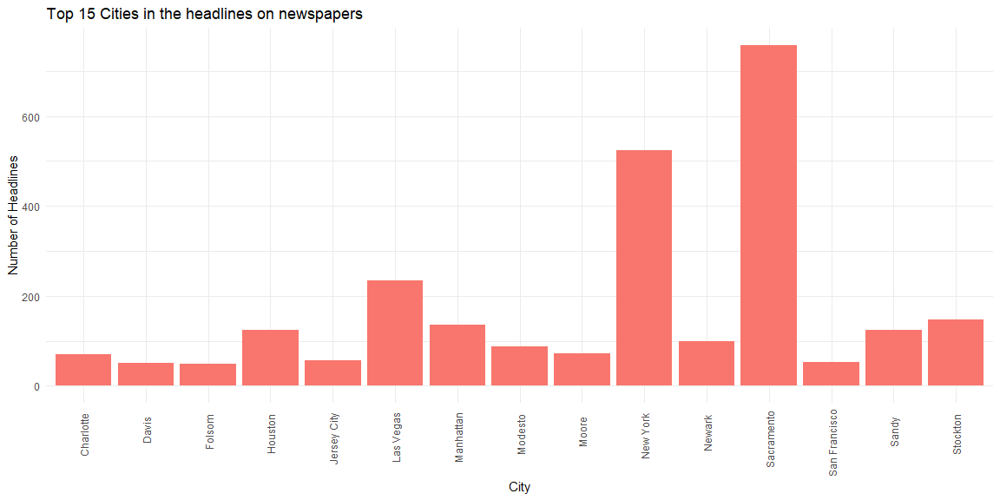
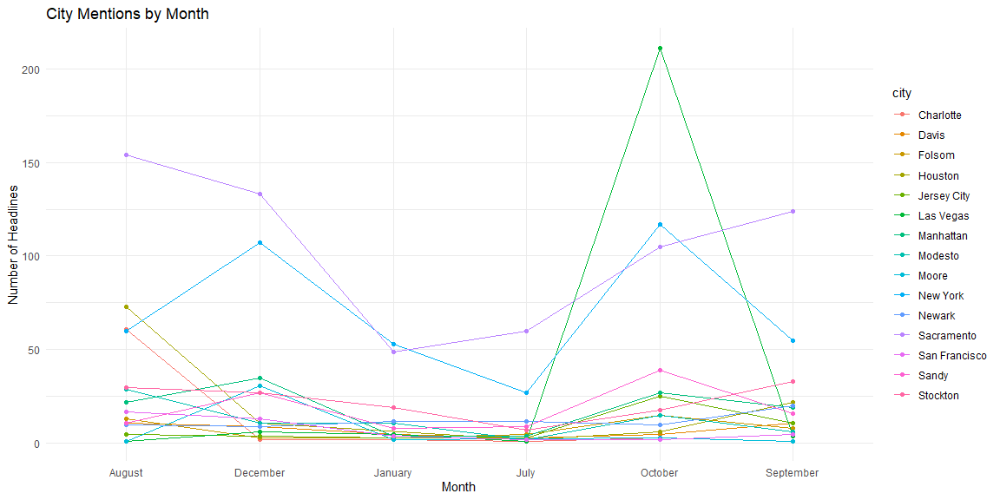
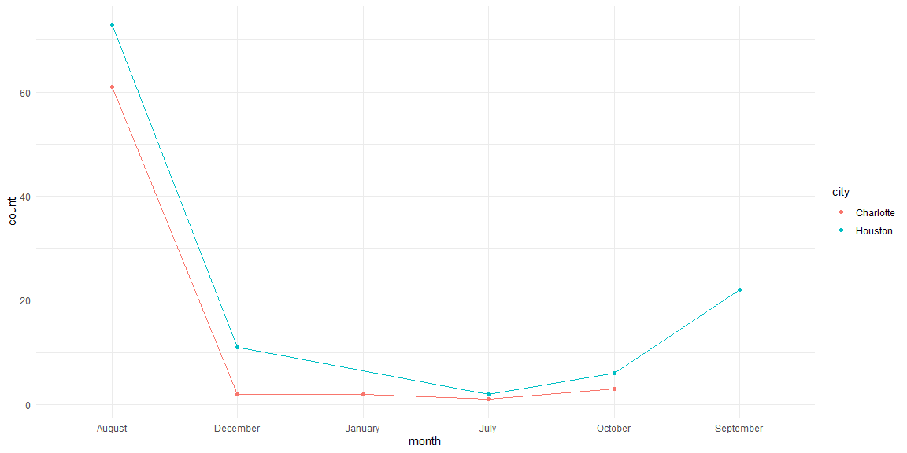

```r
# Use this R-Chunk to import all your datasets!

ABC7NY <- read_csv("https://storybench.org/reinventingtv/abc7ny.csv")
KCRA <- read_csv("https://storybench.org/reinventingtv/kcra.csv")

newspapers <- rbind(ABC7NY, KCRA)
```

## Background

You are working for management consulting agency A.T. Kearney which produces the Global Cities report. They have put you on a team in charge of developing a new report - the USA Cities report - which identifies the most influential cities in the United States.

Your manager would like to explore using the frequency with which a city appears in news headlines as a contributing factor to their city rankings. You find data from two major news outlets: one in California (KCRA) and one in New York (ABC7NY). The data spans July 18, 2017 - Jan 16, 2018. You will use the headlines to find which cities are mentioned most in the news.

Specifically, you should identify the 15 cities with the highest headline count overall. You are curious if these cities have sustained headlines over time or if there was a singular event that spiked the headline count. You will also use headline counts to compare individual cities.

After completing the tasks, you might like to run this code again with updated information. Make sure you are writing reproducible code that would work with a larger, more up-to-date dataset.

## Data Wrangling


```r
# Use this R-Chunk to clean & wrangle your data!

cityNames <- us.cities %>% 
  mutate(USnames = substr(name, 1, nchar(name) -3)) %>%
  select(USnames) %>% 
  unique() 

cities <- cityNames$USnames %>% 
  str_flatten(collapse = "|")

months <- str_flatten(c("January", "February", "March", "April", "May", "June", "July", "August", "September", "October", "Novemeber", "December"), collapse = "|")

city_Hlines <- newspapers %>% 
  mutate(city = str_extract(headline, cities),
         month = str_extract(datetime, months)) %>% 
  filter(!is.na(city))
```

## Data Visualization


```r
# Use this R-Chunk to plot & visualize your data!
city_Hlines1 <- city_Hlines %>% 
  group_by(city) %>% 
  summarise(count = n()) %>% 
  arrange(desc(count)) %>% 
  head(15)
```


```r
ggplot(data = city_Hlines1)+
  geom_col(mapping = aes(x=city, y=count, fill ="Red"))+
  theme_minimal()+
  labs(x="City", y="Number of Headlines", title="Top 15 Cities in the headlines on newspapers")+
  theme(axis.text.x = element_text(angle = 90, vjust = 0.5, hjust = 0.8), legend.position = "none")
```

<!-- -->


We can observe which from the most mentioned cities on the newspaper from California and New York. We need to consider that the two top cities mentioned in the graph are indeed from these statesm but I believe is fair since they are big cities where a lot of things happen so I think it is acceptable to keep them.


```r
cities_top15 <- city_Hlines %>%
  group_by(city)%>%
  summarise(count = n())%>%
  arrange(desc(count)) %>%
  head(15)


news_month <- city_Hlines %>%
  filter(city %in% cities_top15$city & !is.na(month)) %>%
  group_by(city, month) %>%
  summarise(count = n())

ggplot(news_month) +
  geom_line(aes(month, count, color = city, group = city)) +
  geom_point(aes(month, count, color = city, group = city)) +
  theme_minimal() +
  labs(y = "Number of Headlines", x = "Month", title = "City Mentions by Month") 
```

<!-- -->

From this Chart it is interesting that both Sacramento and New your sometimes interact and swap places on which city it is the most mentioned but is it not so clear. We also see that cities like Houston, Sandy, and Las Vegas tend to show up at moments, it would be interesting to see what happens every year on Las Vegas to even go higher in count compared to the other two popular cities.


```r
top_2 <- news_month %>% 
  filter(city %in% c("Houston", "Charlotte"))

ggplot(top_2) +
  geom_point(aes(month, count, color = city, group = city, colour = count)) +
  geom_line(aes(month, count, color = city, group = city, colour = count)) +
    theme_minimal() +
  scale_fill_brewer(palette="Spectral")
```

<!-- -->

```r
  labs(y = "Number of Headlines", x = "Month", title = "Charlotte and Houston by Month on newspaper headlines")
```

```
## $y
## [1] "Number of Headlines"
## 
## $x
## [1] "Month"
## 
## $title
## [1] "Charlotte and Houston by Month on newspaper headlines"
## 
## attr(,"class")
## [1] "labels"
```


Looking at the data on Charlotte and Houston, it would be interesting to understand why the popularity of both was so high during August because it seems to be a one-time event since it didn't spike the same way the next year, but after it it went up again over the months. 

