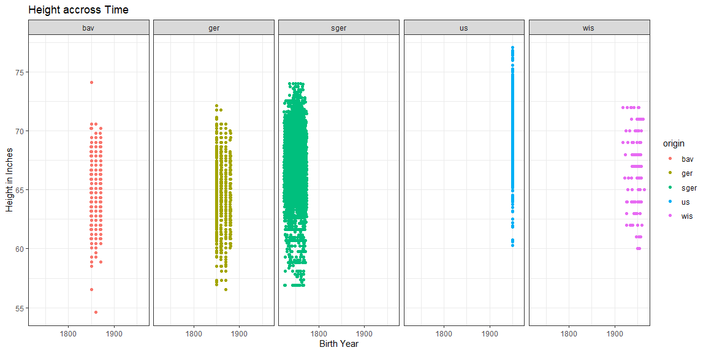
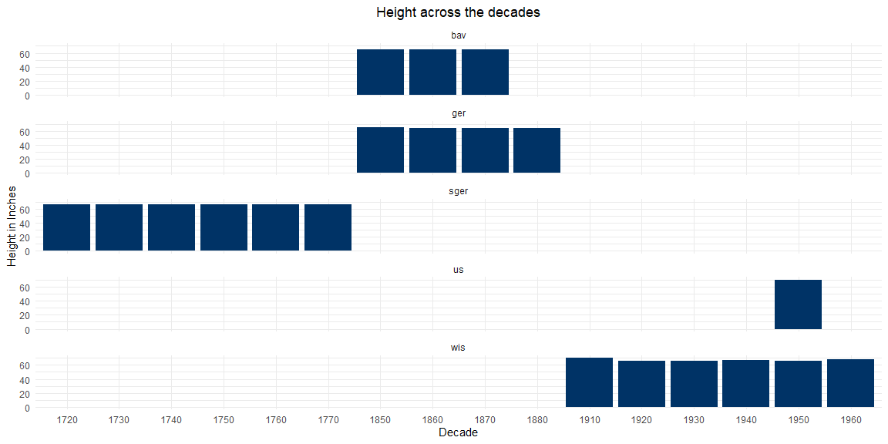

```r
# Use this R-Chunk to import all your datasets!

german_Data <- read_dta("https://byuistats.github.io/M335/data/heights/germanconscr.dta")

bavarian_Data <- read_dta("https://byuistats.github.io/M335/data/heights/germanprison.dta")

temp_url <- "https://byuistats.github.io/M335/data/heights/Heights_south-east.zip"
temp <- tempfile(fileext = ".zip")
tempdir <- tempdir()
download(temp_url, destfile = temp, mode = "wb")
unzip(temp, exdir = tempdir)
southGerman_Data <- read.dbf(str_c(tempdir, "/B6090.DBF"),as.is = FALSE)
file.remove(temp, str_c(tempdir, "/B6090.DBF"), str_c(tempdir, "/b6090.rtf"))
```

```
## [1] TRUE TRUE TRUE
```

```r
bureau_Data <- read_csv("https://raw.githubusercontent.com/hadley/r4ds/main/data/heights.csv")

wis_Data <-read_sav("http://www.ssc.wisc.edu/nsfh/wave3/NSFH3%20Apr%202005%20release/main05022005.sav")
```


## Background

_Place Task Background Here_

## Data Wrangling


```r
# Use this R-Chunk to clean & wrangle your data!

ger <- german_Data %>% 
  mutate(height_cm = height, height_in = .39 * height, birth_year= bdec, origin = "ger") %>% 
  select(birth_year, height_in, height_cm, origin)

bav <- bavarian_Data %>% 
  mutate (height_in= 0.39 * height, height_cm = height, origin= "bav", birth_year= bdec ) %>% 
  select(birth_year, height_in, height_cm, origin)

sger <- southGerman_Data %>% 
  mutate(birth_year= GEBJ, height_cm = CMETER, height_in= .39* height_cm, origin = "sger") %>% 
  select(birth_year, height_in, height_cm, origin)

us <- bureau_Data %>% 
  mutate(height_in= height, height_cm= height/.39, birth_year= 1950, origin = "us") %>% 
  filter(sex == "male") %>% 
  select(birth_year, height_in, height_cm, origin)

wis <- wis_Data %>% 
  mutate(birth_year = DOBY + 1900, height_in = 12* RT216F + RT216I, height_cm = height_in / .39, origin = "wis", sex = RE35) %>%
  filter(height_in <= 72 & height_in>=0 & sex == 1 ) %>% 
   select(birth_year, height_in, height_cm, origin)


 heights_data <- bind_rows(ger, bav, sger, us, wis) 
 save(heights_data, file= "height_data.RData")
```

For the data wrangling I needed to do the next things for each of the datasets:

1) Mutate the height column so you know it is centimiters, the height from the cm column to inches by multiplying it for .39, change the name of the birth_year, make a column with the alias I chose for the study.

2)Mutate the height column so you know it is centimiters, the height from the cm column to inches by multiplying it for .39, change the name of the birth_year, make a column with the alias I chose for the study.

3)Mutate the height column so you know it is centimiters, the height from the cm column to inches by multiplying it for .39, change the name of the birth_year, make a column with the alias I chose for the study.

4)Mutate the height column so you know it is centimiters, the height from the cm column to inches by multiplying it for .39, change the name of the birth_year, make a column with the alias I chose for the study, filter the sex for only male.

5)Mutate the height column so you know it is centimiters, the height from the cm column to inches by multiplying it for .39, change the name of the birth_year, make a column with the alias I chose for the study, filter the sex for only male (this dataset is tricky since there are a lot of not reported participants, I just took the ones that said Male as gender.)

## Data Visualization


```r
# Use this R-Chunk to plot & visualize your data!
 ggplot(heights_data) +
  geom_jitter(aes(birth_year, height_in, color= origin)) +
    ylab("Height in Inches")+
    xlab("Birth Year")+
    ggtitle("Height accross Time")+
    theme_bw() +
  #facet_wrap(vars(origin))+
  facet_wrap(~origin, ncol = 5)
```

<!-- -->


```r
decades <- heights_data %>% 
  mutate(decade = case_when(

    birth_year >= 1720 & birth_year < 1730 ~ 1720,
    birth_year >= 1730 & birth_year < 1740 ~ 1730,
    birth_year >= 1740 & birth_year < 1750 ~ 1740,
    birth_year >= 1750 & birth_year < 1760 ~ 1750,
    birth_year >= 1760 & birth_year < 1770 ~ 1760,
    birth_year >= 1770 & birth_year < 1780 ~ 1770,
    birth_year >= 1780 & birth_year < 1790 ~ 1780,
    birth_year >= 1790 & birth_year < 1800 ~ 1790,
    
    birth_year >= 1800 & birth_year < 1810 ~ 1800,
    birth_year >= 1810 & birth_year < 1820 ~ 1810,
    birth_year >= 1820 & birth_year < 1830 ~ 1820,
    birth_year >= 1830 & birth_year < 1840 ~ 1830,
    birth_year >= 1840 & birth_year < 1850 ~ 1840,
    birth_year >= 1850 & birth_year < 1860 ~ 1850,
    birth_year >= 1860 & birth_year < 1870 ~ 1860,
    birth_year >= 1870 & birth_year < 1880 ~ 1870,
    birth_year >= 1880 & birth_year < 1890 ~ 1880,
    birth_year >= 1890 & birth_year < 1900 ~ 1890,
    
    birth_year >= 1900 & birth_year < 1910 ~ 1900,
    birth_year >= 1910 & birth_year < 1920 ~ 1910,
    birth_year >= 1920 & birth_year < 1930 ~ 1920,
    birth_year >= 1930 & birth_year < 1940 ~ 1930,
    birth_year >= 1940 & birth_year < 1950 ~ 1940,
    birth_year >= 1950 & birth_year < 1960 ~ 1950,
    birth_year >= 1960 & birth_year < 1970 ~ 1960)) %>% 
  group_by(origin, decade) %>% 
    summarise(mean = mean(height_in))
```


```r
# Use this R-Chunk to plot & visualize your data!

ggplot(decades, aes(x = as.factor(decade), y = mean)) +
  geom_bar(stat="identity", fill = "#003366" )+ 
  theme_minimal() +
  labs(x="Decade", y = "Height in Inches") +
  ggtitle("Height across the decades") + theme(plot.title = element_text(hjust = 0.5))+
  facet_wrap(~origin, ncol = 1)
```

<!-- -->


## Conclusions


Chart no.1 Shows the way the all the individuals in each study, we can see that there are datasets with bigger samples, as well we can observe the distrubution along time for each dataset.

In Chart no.2 same as with the previous one, I try to divide it by study but when I did this I saw that the datasets do not have information across the whole leg of time that we are observing. What I can observe is that German men have become short by what we have on the data, while bavarian man have became taller. Finally US men used to be taller then they became a little short but then by the 60's it seems to start having more men being tall.
