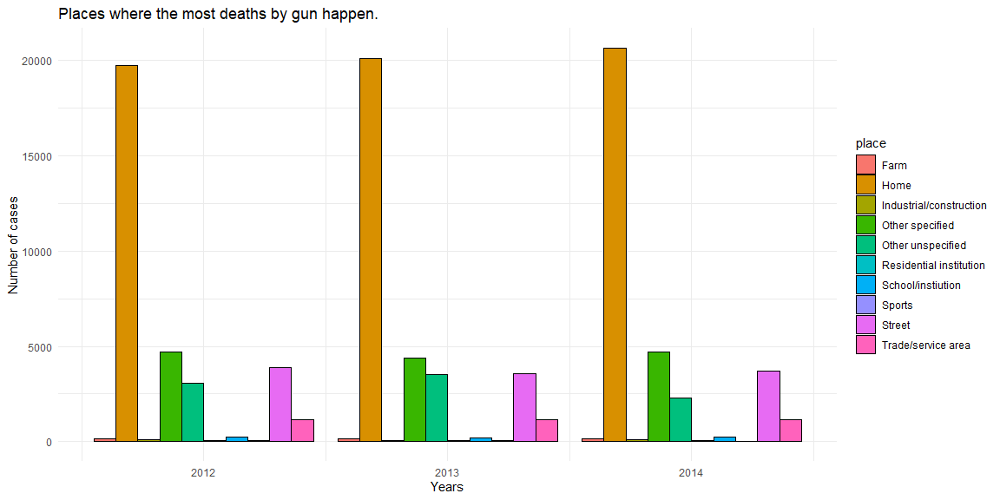
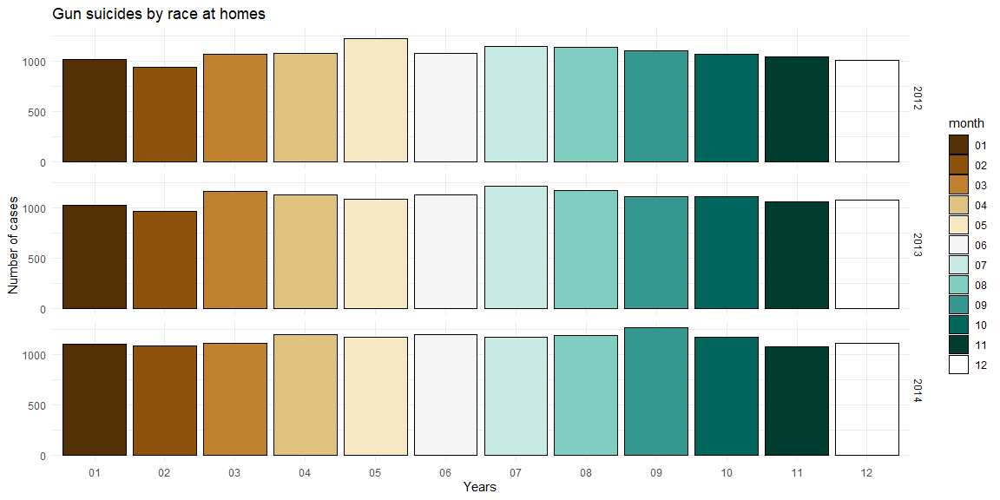

```r
# Use this R-Chunk to import all your datasets!
gundeaths <- read_csv("https://github.com/fivethirtyeight/guns-data/blob/master/full_data.csv?raw=true")
```

## Background

The world is a dangerous place. During 2015 and 2016 there was a lot of discussion in the news about police shootings. FiveThirtyEight reported on gun deaths in 2016. As leaders in data journalism, they have posted a clean version of this data in their GitHub repo called full_data.csv for us to use. Load the data with the following command (you’ll need to assign the data to a variable).


```r
report_place_1 <- gundeaths %>% 
  filter(!is.na(place)) %>% 
  group_by(place, year) %>% 
  summarize(count = n())
```
## Gun Deaths.

In matters related to safety, one of the main concerns we would like to know in order to help society to help them prevent situations where they can find themselves at risk, we want to understand where these types of events happen. We will analyse the data by the places where these reports come and see if they have change over time.


```r
report_place <- gundeaths %>%
  filter(!is.na(place)) %>% 
  group_by(place, year) %>% 
  tally() %>% 
  spread(year, n) %>% 
pander()
```


```r
ggplot(data = report_place_1, aes(x = year, y = count, fill = place)) +
  geom_bar(stat= "identity", color = "black", position = position_dodge())+
  labs(x= "Years",
       y = "Number of cases",
       title = "Places where the most deaths by gun happen.",
        color = "Type of report") +
  theme_minimal()
```

<!-- -->

From the reports we can see a notable majority of places where this happen are at home, then Other places and at the street, as well others that are not specified but, not even these other three categories together reach the number of deaths declared at homes. Since our main concern are families we will try to understand this better on what is the intent specified in the report.


```r
report_type_1 <- gundeaths %>% 
  filter(!is.na(intent) & place == "Home") %>% 
  group_by(intent, year) %>% 
  summarize(count = n())
```


```r
# Use this R-Chunk to clean & wrangle your data!
report_type <- gundeaths %>%
  filter(!is.na(intent) & place == "Home") %>% 
  group_by(intent, year) %>% 
  tally() %>% 
  spread(year, n) %>% 
pander()
```


```r
ggplot(data = report_type_1, aes(x = year, y = count, fill = intent)) +
  geom_bar(stat= "identity", color = "black", position = position_dodge())+
  labs(x= "Years",
       y = "Number of cases",
       title = "Most common types of deaths by gun at homes",
        color = "Type of report") +
  theme_minimal()
```

<!-- -->
From this chart, is more than evident than Guns have become a threat to families by taken parts of families due sucide. It is concerning how this number is steady along the years. Due suicide be a consecuence of poor habits and a lack of mental stability most of times, where visiting with a Mental Health provider can be prevented. In the effort of understanding what type of families are more propense to be involved in this types of situaitons, we will analyse the race written on the reports.


```r
suicide <- gundeaths %>% 
  filter(!is.na(intent) & intent == "Suicide" & place == "Home") %>% 
  group_by(race, year) %>% 
  summarize(count = n())
```

```r
suicides <- gundeaths %>%
  filter(!is.na(intent) & intent == "Suicide" &  place == "Home") %>% 
  group_by(race, year) %>% 
  tally() %>% 
  spread(year, n) %>% 
pander()
```


Now that we understand more about suicides at home being the major cause of gun deads in America we would like to help those families to not have to experience these types of events as much as possible. Our intent now is to understand what races are struggling the most so we can provide the needed help to these groups.

--------------------------------------------------------
              race                2012    2013    2014  
-------------------------------- ------- ------- -------
     Asian/Pacific Islander        152     173     158  

             Black                 759     750     761  

            Hispanic               737     733     777  

 Native American/Native Alaskan    150     139     133  

             White                12928   13234   13831 
--------------------------------------------------------


```r
# Use this R-Chunk to plot & visualize your data!
ggplot(data = suicide, aes(x = year, y = count, fill = race)) +
  geom_bar(stat= "identity", color = "black", position = position_dodge())+
  scale_fill_brewer(palette="Spectral")+
  labs(x= "Years",
       y = "Number of cases",
       title = "Gun suicides by race at homes") +
  theme_minimal()
```

<!-- -->


Finally we would like to understand more if there is a type of seasonal trend, if seasons like christmas, tax-season or any other of time trends can be noticed in the data trying to understand more about the suicides at white households.

```r
white_suicide <- gundeaths %>% 
  filter(!is.na(intent) & intent == "Suicide" & place == "Home" & race == "White") %>% 
  group_by(race, month, year) %>% 
  summarize(count = n())
```


```r
# Use this R-Chunk to plot & visualize your data!
ggplot(data = white_suicide, aes(x = month, y = count, fill = month)) +
  geom_bar(stat= "identity", color = "black", position = position_dodge())+
  scale_fill_brewer(palette="BrBG")+
  labs(x= "Years",
       y = "Number of cases",
       title = "Gun suicides by race at homes") +
  theme_minimal() +
  facet_grid(rows = vars(year))
```

<!-- -->
The numbers change among the years so there is not really information that backs up our intent to fund trends though usually during April numbers ten to start increasing and by the end of the Fall we can get to see this part happening in the three years of data.

## Conclusions

We understand that our main audience should be the White people households, trying to help them understand what is happening in other place. We would like to encourage white households to seek help in moments of desperation where the easy exit seems to be the only one. Trying to make more aware resources to their reach like the suicide line, or seeking help from profesionals.
Understanding that these types of situations might happen in other types of households, the data throws this information, we might need to understand if this also happens because White households tend to report this events and other don't
